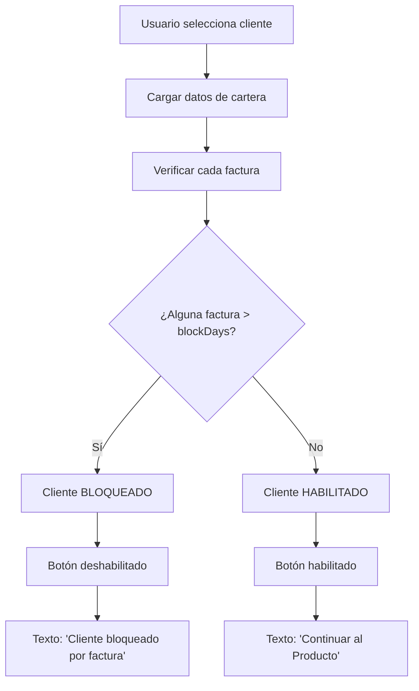
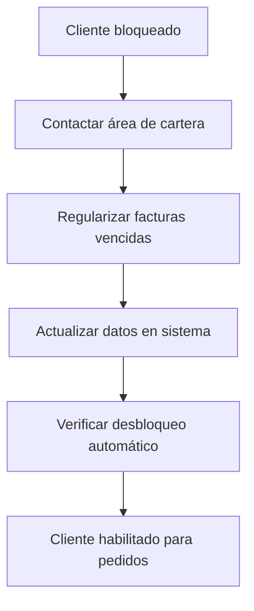

# Guía de Verificación de Deudas - Sura Pedidos Web

## 📋 Introducción

Este documento describe la verificación de deudas en **Sura Pedidos Web** (Suramericana JI SAS). El **bloqueo del botón "Continuar al Producto"** usa el umbral `APP_CONFIG.portfolio.blockDays` en `src/config/app.config.ts` (valor por defecto **30**): si alguna factura cumple `Number(factura.dias) > blockDays`, el cliente no puede avanzar al catálogo hasta regularizar cartera.

## 🎯 Funcionalidad Principal

### Bloqueo Automático de Clientes

El sistema verifica automáticamente si alguna factura supera `portfolio.blockDays` y:

- **Bloquea el botón** "Continuar al Producto"
- **Cambia el texto** a "Cliente bloqueado por factura"
- **Muestra mensaje explicativo** sobre la situación
- **Impide la navegación** al catálogo de productos

### Criterios de Bloqueo

```typescript
// Un cliente se bloquea en la UI si (blockDays viene de app.config):
import { APP_CONFIG } from "../config/app.config";
const { blockDays } = APP_CONFIG.portfolio;
cliente.cartera.some((factura) => Number(factura.dias) > blockDays);
```

**Ejemplo de factura bloqueada:**

```json
{
  "fac": "SURA 47126",
  "fecha": "14/08/2025",
  "valor": 664051,
  "dias": 45 // ← Ejemplo: supera blockDays si blockDays es 30
}
```

## 🔍 Cómo Funciona la Verificación

### 1. Estructura de Datos

```typescript
interface Factura {
  id: string | number;
  cliente: string;
  vendedor: string;
  fac: string; // Número de factura
  fecha: string; // Fecha de emisión
  valor: string | number; // Valor de la factura
  dias: string | number; // Días de vencimiento
}

interface ClienteDeuda {
  id: string | number;
  nombre: string;
  sucursales?: any[];
  cartera?: Factura[]; // ← Array de facturas del cliente
}
```

### 2. Proceso de Verificación



### 3. Estados del Sistema

| Estado del Cliente | Días de facturas (vs `blockDays`) | Botón         | Acción                   |
| ------------------ | --------------------------------- | ------------- | ------------------------ |
| **Normal**         | Ninguna con `dias > blockDays`    | Habilitado    | Navegar a productos      |
| **Bloqueado**      | Alguna con `dias > blockDays`     | Deshabilitado | Mostrar mensaje de error |
| **Sin Cartera**    | Sin facturas                      | Habilitado    | Navegar a productos      |

## 💻 Implementación Técnica

### Utilidades de Verificación

```typescript
// utils/atomic-design/deudaUtils.ts
import { Factura, ClienteDeuda } from "./types";

/**
 * Verifica si un cliente tiene facturas vencidas
 */
export function tieneFacturasVencidas(
  cliente: ClienteDeuda | null,
  diasLimite: number = 40 // por defecto 40; para igualar la UI, pasar APP_CONFIG.portfolio.blockDays
): boolean {
  if (!cliente?.cartera) return false;

  return cliente.cartera.some((factura) => {
    const dias = Number(factura.dias) || 0;
    return dias > diasLimite;
  });
}

/**
 * Obtiene todas las facturas vencidas
 */
export function obtenerFacturasVencidas(
  cliente: ClienteDeuda | null,
  diasLimite: number = 40 // idem tieneFacturasVencidas
): Factura[] {
  if (!cliente?.cartera) return [];

  return cliente.cartera.filter((factura) => {
    const dias = Number(factura.dias) || 0;
    return dias > diasLimite;
  });
}
```

### Uso en Componentes

```jsx
// En ClienteSelectorReact.jsx (implementación real: useMemo + APP_CONFIG.portfolio.blockDays)
import { APP_CONFIG } from "../../config/app.config";

const { blockDays } = APP_CONFIG.portfolio;
const bloqueado = carteraCliente.some(
  (factura) => Number(factura.dias) > blockDays
);
```

## 🎨 Experiencia de Usuario

### Indicadores Visuales

#### 1. Botón Normal

```jsx
<button className="atom-button atom-button--primary">
  Continuar al Producto
</button>
```

#### 2. Botón Bloqueado

```jsx
<button className="atom-button atom-button--blocked" disabled>
  Cliente bloqueado por factura
</button>
```

#### 3. Mensaje de Ayuda

```jsx
<div className="help-message">
  El cliente tiene facturas vencidas mayores a {blockDays} días. Contacte al área
  de cartera para resolver.
</div>
```

### Estados de Facturas

| Días (vs `blockDays`) | Color | Estado    | Acción           |
| --------------------- | ----- | --------- | ---------------- |
| **≤ blockDays**       | Verde | Normal    | Permitir pedido  |
| **> blockDays**       | Rojo  | Bloqueado | Bloquear sistema |

## 📊 Casos de Uso

### Caso 1: Cliente sin Deudas

```json
{
  "cliente": "EMPRESAS ABC SAS",
  "cartera": [
    { "fac": "001", "dias": 15, "valor": 1000000 },
    { "fac": "002", "dias": 30, "valor": 2500000 }
  ]
}
```

**Resultado**: ✅ Cliente habilitado, puede realizar pedidos

### Caso 2: Cliente con facturas que superan `blockDays`

Con `blockDays` en 30, basta una factura con `dias` mayor a 30.

```json
{
  "cliente": "COMERCIO XYZ LTDA",
  "cartera": [
    { "fac": "003", "dias": 95, "valor": 5000000 },
    { "fac": "004", "dias": 25, "valor": 1500000 }
  ]
}
```

**Resultado**: ❌ Cliente bloqueado, no puede realizar pedidos

### Caso 3: Cliente sin Cartera

```json
{
  "cliente": "NUEVO CLIENTE SAS",
  "cartera": []
}
```

**Resultado**: ✅ Cliente habilitado, puede realizar pedidos

## 🔧 Configuración y Personalización

### Cambiar el umbral de bloqueo (UI)

```typescript
// src/config/app.config.ts
portfolio: {
  // ...
  blockDays: 30, // ajustar aquí; afecta ClienteSelectorReact y ClienteSelectorTemplate
},
```

Si usas `deudaUtils.tieneFacturasVencidas` con el mismo criterio que la pantalla, pasa `APP_CONFIG.portfolio.blockDays` como segundo argumento.

### Mensajes Personalizados

```jsx
// En componente React
import { APP_CONFIG } from "../config/app.config";

const getBloqueoMessage = (cliente) => {
  const diasLimite = APP_CONFIG.portfolio.blockDays;
  const facturasVencidas = obtenerFacturasVencidas(cliente, diasLimite);
  const totalDeuda = calcularDeudaVencida(cliente, diasLimite);

  return `Cliente bloqueado por ${
    facturasVencidas.length
  } factura(s) vencida(s) por ${formatearMoneda(
    totalDeuda
  )}. Contacte al área de cartera.`;
};
```

## 🚨 Manejo de Errores

### Tipos de Error

1. **Error de Carga de Datos**

   ```jsx
   // Mostrar spinner de carga
   {
     isLoading && <Icon name="loading" />;
   }
   ```

2. **Error de Datos Inválidos**

   ```jsx
   // Validar estructura de datos
   if (!cliente.cartera) {
     return <div>Error: No se pudieron cargar los datos de cartera</div>;
   }
   ```

3. **Error de Cálculo**
   ```typescript
   // Manejo seguro de valores
   const dias = Number(factura.dias) || 0;
   const valor =
     Number(String(factura.valor).replace(/\./g, "").replace(",", ".")) || 0;
   ```

## 📱 Responsive y Accesibilidad

### Responsive Design

```css
/* Móvil */
@media (max-width: 768px) {
  .blocked-button {
    font-size: 0.9rem;
    padding: 0.75rem 1.25rem;
  }
}

/* Desktop */
@media (min-width: 769px) {
  .blocked-button {
    font-size: 1.1rem;
    padding: 1rem 2rem;
  }
}
```

### Accesibilidad

```jsx
// Atributos ARIA para lectores de pantalla
<button
  disabled={clienteBloqueado}
  aria-describedby="bloqueo-help"
  role="button"
>
  {clienteBloqueado ? 'Cliente bloqueado por factura' : 'Continuar al Producto'}
</button>

<div id="bloqueo-help" role="alert">
  {/* Texto alineado con APP_CONFIG.portfolio.blockDays */}
  El cliente tiene facturas vencidas mayores a {blockDays} días. Contacte al área
  de cartera para resolver.
</div>
```

## 🔍 Debugging y Testing

### Herramientas de Debug

```typescript
// En desarrollo, agregar logs
import { APP_CONFIG } from "../config/app.config";

console.log("Cliente:", cliente);
console.log("Facturas:", cliente?.cartera);
console.log(
  "Bloqueado:",
  tieneFacturasVencidas(cliente, APP_CONFIG.portfolio.blockDays)
);
```

### Testing Manual

1. **Preparar datos de prueba** con alguna factura con `dias > portfolio.blockDays`
2. **Seleccionar cliente** en la interfaz
3. **Verificar bloqueo** del botón
4. **Confirmar mensaje** de error
5. **Verificar desbloqueo** después de actualizar datos

### Casos de Prueba

```javascript
// Test cases para verificarFacturasVencidas
const testCases = [
  {
    nombre: "Cliente sin cartera",
    cliente: { id: 1, nombre: "Test", cartera: [] },
    resultado: false,
  },
  {
    nombre: "Cliente con facturas normales",
    cliente: {
      id: 2,
      nombre: "Test",
      cartera: [{ dias: 15 }, { dias: 30 }, { dias: 40 }],
    },
    resultado: false,
  },
  {
    nombre: "Cliente con facturas vencidas (según blockDays, p. ej. 30)",
    cliente: {
      id: 3,
      nombre: "Test",
      cartera: [{ dias: 95 }, { dias: 25 }],
    },
    resultado: true,
  },
];
```

## 📋 Procedimiento para Desbloqueo

### Para Clientes Bloqueados

1. **Identificar facturas vencidas** en la tabla de cartera
2. **Contactar al área de cartera** para regularización
3. **Actualizar datos** en el sistema
4. **Verificar desbloqueo** automático del botón

### Proceso de Regularización



## 🔧 Mantenimiento

### Actualizar Límite de Días

1. Modificar el valor por defecto en `deudaUtils.ts`
2. Actualizar documentación
3. Probar con casos existentes
4. Desplegar cambios

### Agregar Nuevas Validaciones

```typescript
// Ejemplo: Bloqueo por monto total
export function bloqueoPorMontoTotal(cliente, montoLimite = 10000000) {
  const deudaTotal = calcularDeudaVencida(cliente);
  return deudaTotal > montoLimite;
}
```

## 📞 Soporte

Para preguntas o problemas relacionados con la verificación de deudas:

- **Equipo de Desarrollo**: soporte.tecnico@sura.com
- **Área de Cartera**: cartera@sura.com
- **Documentación**: Consultar `doc/09-arquitectura-atomic-design.md`

---

_Este documento se actualiza automáticamente con cada cambio en la funcionalidad de verificación de deudas._
